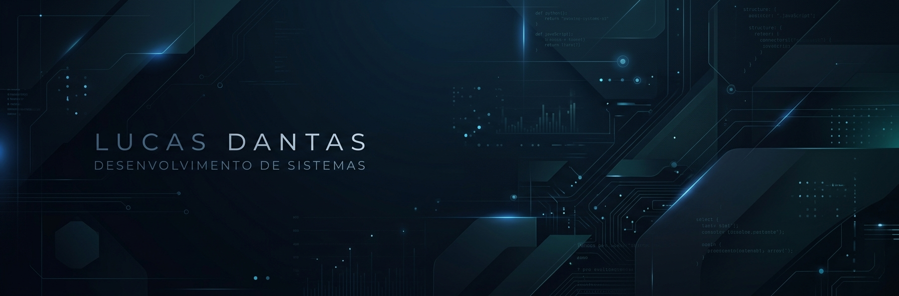

  

# 👋 Olá, eu sou o Lucas!

### 🎓 Técnico em Desenvolvimento de Sistemas | SENAI

Estudante de Desenvolvimento de Sistemas, aprendendo desenvolvimento web e programação através de projetos práticos.

Gosto de transformar ideias em projetos e estou sempre buscando aprender novas tecnologias e melhorar minhas habilidades.

---

## 🛠️ Minhas tecnologias

- HTML
- CSS
- JavaScript
- Git
- GitHub

---

## 📚 Atualmente estudando

🔹 HTML e CSS  
🔹 JavaScript  
🔹 Git e GitHub  
🔹 Desenvolvimento Web  
🔹 Desenvolvimento de Sistemas

---

## 🎓 Formação

**Técnico em Desenvolvimento de Sistemas**  
SENAI

---

## 🚀 Projetos

Em breve, novos projetos estarão disponíveis por aqui!

---

### Sempre aprendendo, criando e evoluindo. 🚀
